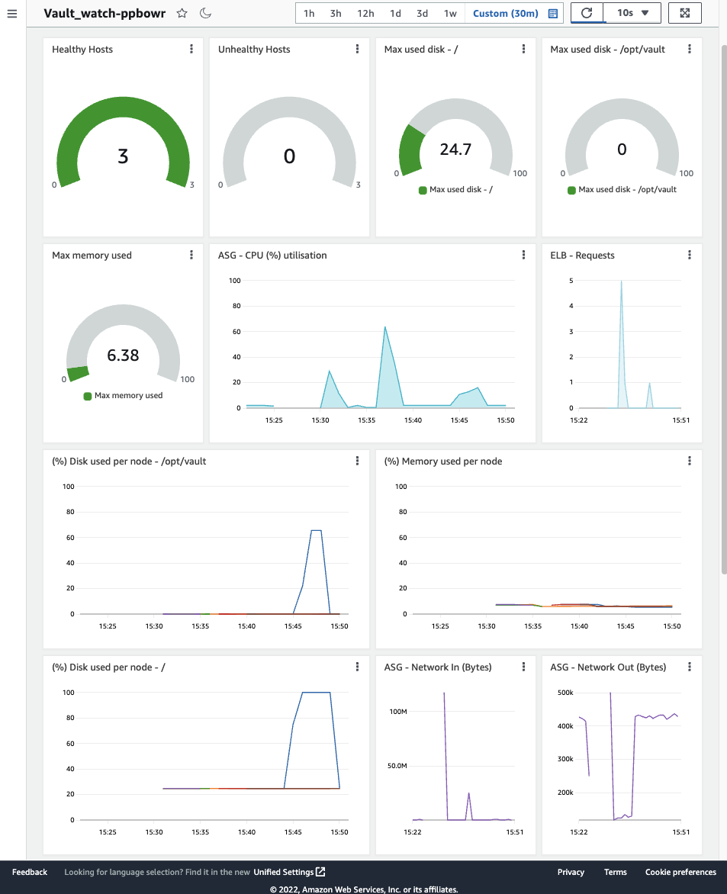

# HashiCorp Vault on AWS

This code spins up a HashiCorp Vault cluster:

- Spread over availability zones.
- Using automatic unsealing.
- Automatically join other nodes in the cluster.
- With a load balancer.
- An optional bastion host.
- Use 3 or 5 nodes, based on the amount of availability zones.
- Either create a VPC or use an existing one.

## Overview

```text

    \0/        +--------------+
     | ------> | loadbalancer |
    / \        +--------------+
    OPS               | :8200/tcp
                      V
+---------+    +------------+
| bastion | -> | instance 0 |+
+---------+    +------------+|+
     ^          +------------+|
     |           +------------+
    \0/
     |
    / \
    DEV             
```

- Details on the [network setup](NETWORK.MD).
- Details on the [target groups](TARGET_GROUPS.md).
- Details on [testing](TESTING.md).
- Details on [upgrading](UPGRADING.md).
- Detauls on [telemetry](TELEMETRY.md).

These (most important) variables can be used.

- `name` - default: `"unset"`.
- `certificate_arn` - The AWS certificate ARN that can be installed on the load balancer.
- `key_name` - The key to use to login. (Conflicts wiht `key_filename`. Use either, not both.)
- `cloudwatch_monitoring` - default: `false`; Configures monitoring for the Vault deployment with AWS native Cloudwatch + Cloudwatch-agent. See the Monitoring section for extra information and a preview.

More variables can be found in [variables.tf](variables.tf).

## Deployment

After spinning up a Vault cluster for the fist time, login to one of the Vault cluster members and initialize Vault:

```shell
vault operator init
```

This generates recovery tokens and a root key, keep them safe and secure.

You must turn on auto-cleanup of dead raft peers in order to remove dead nodes and keep a majority of the Vault nodes healthy during scaling activities.

```shell
vault login ROOT_TOKEN
vault operator raft autopilot set-config \
  -min-quorum=3 \
  -cleanup-dead-servers=true \
  -dead-server-last-contact-threshold=120
```

> NOTE: There are some variable values in the above example, please have a look at the output of the module, it instructs the specific command to run.

## Network

You can **not** specify a `vpc_id`. In that case, this module will create all required network resources.

If you **do** specify a `vpc_id`, you will need to have:

- `aws_vpc`
- `aws_internet_gateway`
- `aws_route_table`
- `aws_route`
- `aws_subnet`
- `aws_route_table_association`

## Backup & restore

To create a backup, log in to a Vault node, use `vault login` and run:

```shell
vault operator raft snapshot save /vault/data/raft/snapshots/raft-$(date +'%d-%m-%Y-%H:%M').snap
```

To restore a snapshot, run:

```shell
vault operator raft snapshot restore FILE
```

## Monitoring

Currently monitoring is available with AWS native tools by setting the `cloudwatch_monitoring` boolean to `true`, see also: `examples/cloudwatch`.

Preview:  


## Cost

To understand the cost for this service, you can use cost.modules.tf:

```shell
terraform apply
terraform state pull | curl -s -X POST -H "Content-Type: application/json" -d @- https://cost.modules.tf/
```

Here is a table relating `size` to a monthly price. (Date: Feb 2022)

| Size (`size`) | Monthly price x86_64 ($) | Monthly price arm64 ($) |
|---------------|--------------------------|-------------------------|
| `custom`      | Varies: 223.34 *         | Varies: +- 193.00 **    |
| `development` | 50.98                    | `size` != `custom` ***  |
| `minimum`     | 257.47                   | `size` != `custom` ***  |
| **`small`**   | 488.59                   | `size` != `custom` ***  |
| `large`       | 950.83                   | `size` != `custom` ***  |
| `maximum`     | 1875.31                  | `size` != `custom` ***  |

When `size` is set to `custom`, these parameters determine the price:

- `volume_iops`
- `volume_size`
- `volume_type`

(*) The price for `size = "custom"` in the table above is based on the settings in `examples/custom`.
(**) The [cost analysis tool](https://cost.modules.tf/) does not support Graviton, so the price was analysed manually.
(***) The Graviton types can only be used when `size` is set to `custom`.
